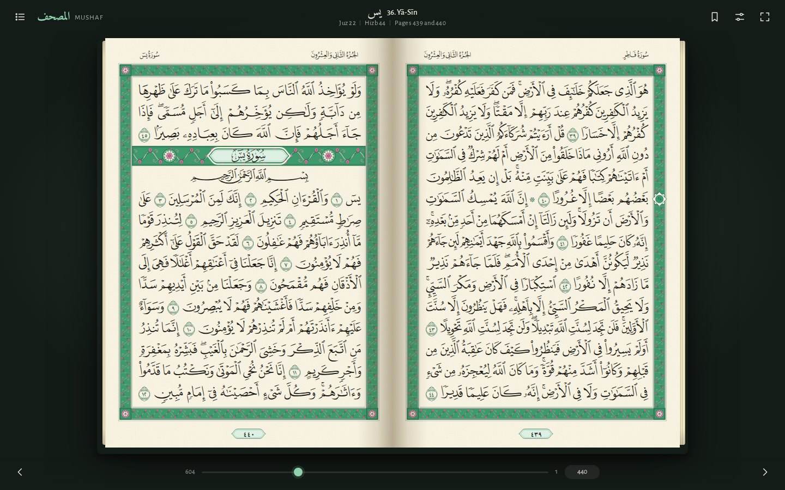
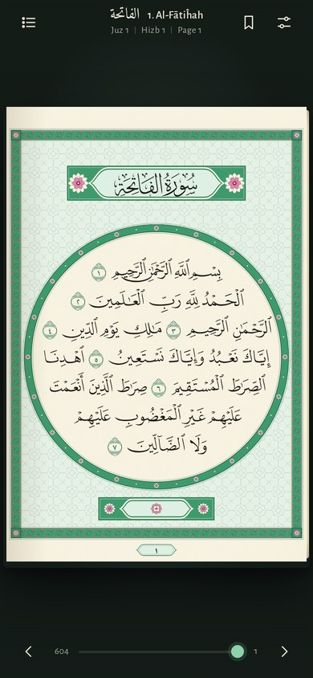
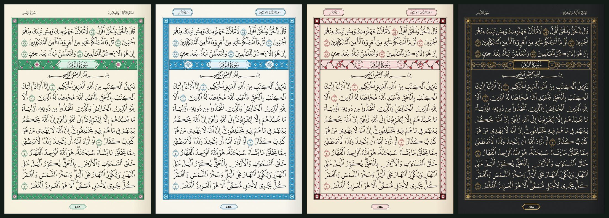

# Quran Mushaf

The Madinah Mushaf as an open book in the browser. All 604 pages, 15 lines each, in the
King Fahd Complex script by Uthman Taha, laid out line for line as in the printed copy.
No translation, no commentary, only the Mushaf.





## What it does

- **Printed layout.** Every line breaks exactly where it does in the 1441 AH Madinah print.
  Justified lines, the centred lines at the ends of short surahs, surah banners and the
  bismillah all sit on the same lines as on paper.
- **Four Mushaf styles, each with its own ornament.**
  Madinah has a cream vine with pink tulips on a green border, Azure a white interlaced chain
  with palmette banners and cartouche headers, Rose dark scrolls with red half palmettes and
  surah banners showing the order and verse count, and Night gold strapwork on charcoal.
- **Ornament.** The illuminated frame, the banner above each surah, the medallion around
  Al-Fatihah and the opening of Al-Baqarah, the page number cartouche, and margin medallions
  at every quarter of a hizb and at each verse of prostration.
- **A real book.** Right-to-left two-page spreads with a 3D page turn, page edges that
  thicken as you read, and a single page on phones.
- **Finding your place.** Index of the 114 surahs and 30 juz with search, go to any page or
  verse (type `440` or `2:255`), bookmarks shown as a ribbon on the page, and the reader
  reopens where you stopped. Click a verse, or press and hold it on a phone, to highlight it.
- **Install and read offline.** It installs as an app on phones and computers, and one tap
  in Settings saves all 604 pages on the device.

<br clear="right">



## Reading

| Action | Keyboard | Mouse or touch |
| --- | --- | --- |
| Next page | `←`, `Space`, `Page Down` | Click the left margin, or swipe right |
| Previous page | `→`, `Shift+Space`, `Page Up` | Click the right margin, or swipe left |
| Contents | `I` | ☰ button |
| Go to a page or verse | `G` | Contents, then Go to (`440` or `2:255`), or the slider |
| Bookmark | `B` | Ribbon button |
| Next Mushaf style | `T` | Settings button |
| Full screen | `F` | Full screen button |
| Highlight an ayah | | Click a word (desktop) or press and hold (touch) |

Link to a page with its number: `index.html#440` opens Ya-Sin.

## Running it

It is a static site with no build step.

```sh
npx serve .            # or: python3 -m http.server
```

Then open http://localhost:3000 (or :8000). Opening `index.html` directly from disk also works.

To publish it, enable GitHub Pages for this repository (Settings → Pages → Deploy from a
branch, folder `/`). The `.nojekyll` file is already in place.

### Fonts

The Mushaf fonts are not stored in this repository. The reader loads them from the
[`quran-qcf4`](https://www.npmjs.com/package/quran-qcf4) package through jsDelivr, one
font per group of about 13 pages, and fetches the neighbouring groups ahead of time.
To read offline, download them once into `fonts/` (ignored by git); the reader uses that
folder first when it exists:

```sh
sh scripts/fetch-fonts.sh
```

## How it is built

```
index.html            page shell, toolbar, contents and settings panels
assets/mushaf.css     page geometry, colours of the four Mushaf styles
assets/ornaments.js   the ornament kit of each style: border, banner, cartouches
assets/reader.js      page rendering, page turns, navigation, bookmarks, settings
assets/icons/         app icons
data/mushaf.js        generated: glyph layout of all 604 pages (486 KB)
sw.js                 service worker for offline reading
manifest.webmanifest  install as an app
scripts/              data builder and font downloader
```

Each line of a page is a row of glyphs from the page's QCF4 font. The builder measures
every line with the font's own advance widths, so the reader knows which lines to justify,
which to centre (the short closing lines of surahs, and pages 1 and 2) and which few to
compress slightly. One em is the size of the Qur'an text; everything else on the page,
frame and margins included, is sized in em, so a page scales as one piece.

To regenerate `data/mushaf.js`:

```sh
npm pack quran-qcf4@1.1.0 quran-meta
mkdir -p /tmp/qcf4 /tmp/meta
tar xzf quran-qcf4-1.1.0.tgz -C /tmp/qcf4 && tar xzf quran-meta-*.tgz -C /tmp/meta
pip install fonttools brotli
python3 scripts/build_data.py --qcf4 /tmp/qcf4/package --meta /tmp/meta/package
```

The builder checks every glyph's ayah against the source data and stops if anything
disagrees.

## Sources and credits

- **Script:** Madinah Mushaf, 1441 AH, written by Uthman Taha and published by the King Fahd
  Complex for the Printing of the Holy Qur'an (مجمع الملك فهد لطباعة المصحف الشريف). QCF4
  font version by Ahmad ElGharib. The fonts are provided for rendering the Qur'an only and
  are not redistributed here.
- **Page layout data:** [quran-qcf4](https://github.com/MohamadHajjRabee/quran-qcf4) by
  Mohamad Hajj Rabee, MIT licence.
- **Hizb, juz and sajdah positions:** [quran-meta](https://www.npmjs.com/package/quran-meta),
  MIT licence.
- **Interface type:** Alegreya Sans and Amiri from Google Fonts.
